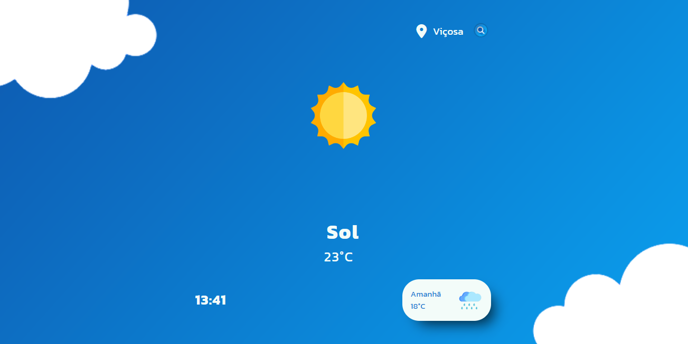

<h1 align="center">Clima Tempo</h1>

## Introdução
Esse é um exemplo de um server-side usando Flask, para o nosso trabalho de Programação 1 (ADS100).

Seguiremos uma lista de [requisitos](Requisitos.md) para a conclusão do projeto.

## Como instalar
Dentro da pasta do reposítorio `ClimaTempo-ADS100`, abra um terminal. 
Digite `pip install -r requirements.txt` 
Dessa forma ele irá instalar todas as bibliotecas usadas no servidor.

## Como usar
Dentro da pasta `server`, abra um terminal. 
Digite `python main.py <IP> <PORTA>`. 
O IP precisa ser o IPV4 ou localhost. Já a porta vai de acordo com sua opção.

## Equipe do Projeto
Dividimos cada área do projeto de acordo com nossas habilidades.
### Design
- Arthur Duarte Mendes
- Maria Eduarda Rosa Pimenta
- Pedro Arthur O. Januário
- Vinícius Quintas Ferreira

### Funcionalidade
- Luiz Miguel Rosa Lazarini Rubio
- Pedro Arthur O. Januário
- Weslley Henrique Dias

## Professor Orientador
Cristiano Luiz Gomide Cabral
